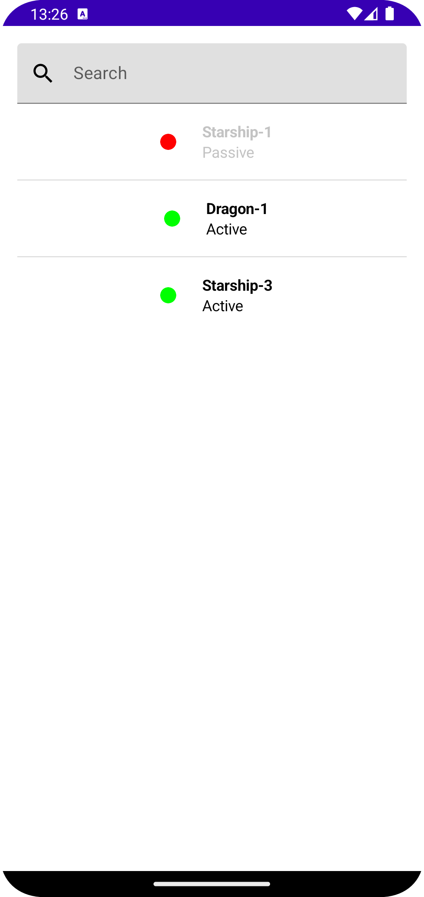
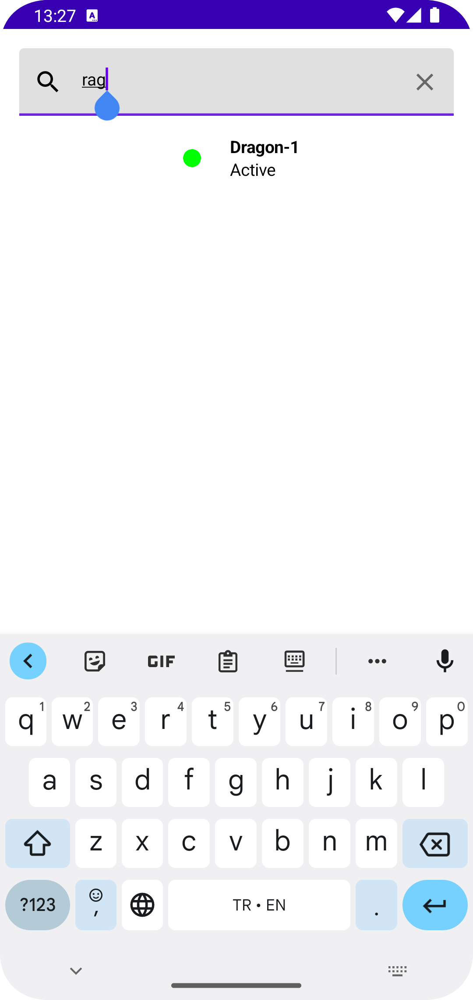

# Multi Module Sample

This application has been developed to use and practice multi-module architecture. It reads the satellite data in the asset folder, caches it by implementing the cache mechanism and displays it in the user interface. On the detail page of the satellites, the positions of these satellites are updated at regular intervals.

### Screenshots

  
  
  
  

## Tech Stack
- [Jetpack Compose](https://developer.android.com/jetpack/compose): UI development
- [Coroutines](https://github.com/Kotlin/kotlinx.coroutines) + [Flow](https://kotlin.github.io/kotlinx.coroutines/kotlinx-coroutines-core/kotlinx.coroutines.flow/) for async programming.
- Jetpack
    - [ViewModel](https://developer.android.com/topic/libraries/architecture/viewmodel) -> Business Logic, UI related data holder and lifecycle aware.
    - [Navigation](https://developer.android.com/jetpack/compose/navigation) -> Navigating screens
    - [Room](https://developer.android.com/training/data-storage/room) -> Local Database for caching
    - [Hilt](https://developer.android.com/training/dependency-injection/hilt-android) -> Dependency Injection

- [kapt](https://kotlinlang.org/docs/kapt.html): Kotlin Annotation Processing Tool

### Unit Test
- JUnit
- [Truth](https://truth.dev/): for performing assertions in tests
- [MockK](https://mockk.io/): mocking objects
- [Runner](https://androidx.tech/artifacts/test/runner/): provides an extensive framework for testing Android apps